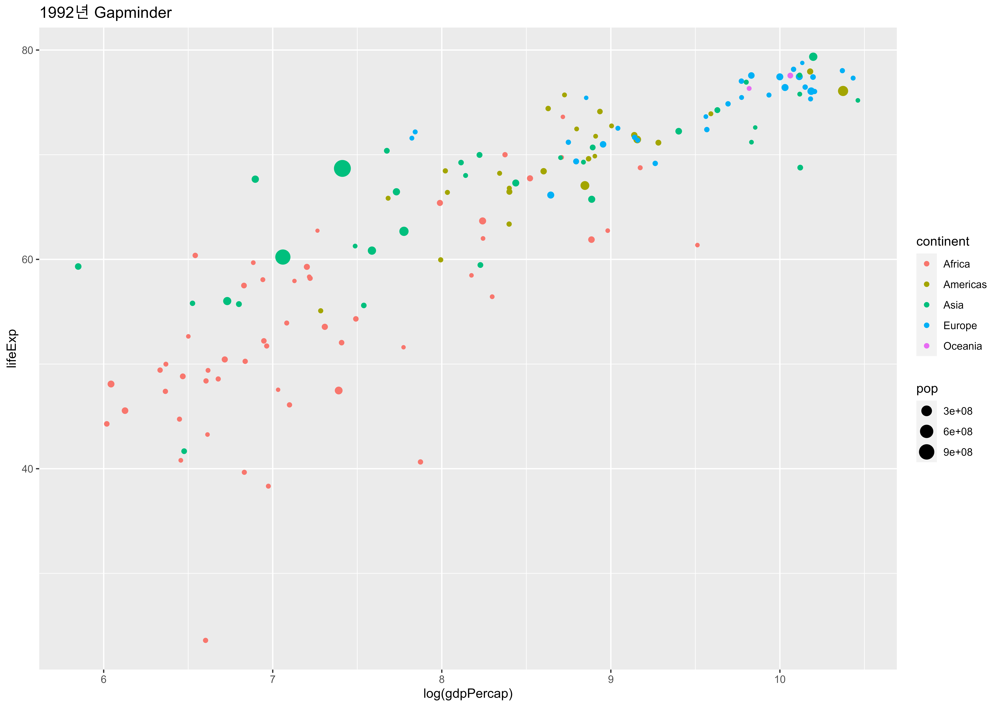

```{r setup, include=FALSE}
library(tidyverse)
library(learnr)
# library(learnrLara)
knitr::opts_knit$set(root.dir = glue::glue("{here::here()}/rbootcamp"))
knitr::opts_chunk$set(echo = FALSE)
```


## 데이터프레임 소개

기본적으로 데이터프레임(`data.frame`)은 다음 특성을 갖는 표같은 형태를 갖추고 있다.

```{r dataframe, echo = FALSE, out.width = "100%", }
knitr::include_graphics("images/tidy-1.png")
```


- 칼럼(column)은 각기 다른 자료형을 갖는다; 숫자(`numeric`), 문자(`character`), 논리(`boolean`), 범주(`factor`).
- 칼럼을 변수(variable)라고도 부른다.
- 행(row)은 단일 관측점에 대응된다.
- 특정 조건에 따라 부분집합(subset) 혹은 필터(filter) 작업을 수행할 수 있다.

`데이터프레임`의 개별 변수는 `$` 연산자로 액세스할 수 있습니다. (예시:  `gap1992$pop`).
그러나 우리는 이 방식을 거의 사용하지 않을 것입니다. `tidyverse`을 사용하면 이 연산자 없이 쉽게 변수를 액세스할 수 있기 때문입니다.

`gap1992` 데이터에 대해서 `colnames()`와 `head()`를 실행하여 각 컬럼의 데이터를 살펴봅니다. 그런 다음 `nrow()`를 사용하여 데이터 세트에 몇 개의 행(관측치)이 있는지 확인합니다.
답변을 제출하기 전에 콘솔에서 실행하세요.

```{r exc-01-01, exercise=TRUE, exercise.eval=TRUE}
gap1992 <- read.csv("data/gap1992.csv")

## gap1992 데이터프레임 살펴보기

## gap1992 칼럼명 살펴보기

##  gap1992 행갯수 확인하기

```

```{r exc-01-01-solution}
gap1992 <- read.csv("data/gap1992.csv")

## gap1992 데이터프레임 살펴보기
head(gap1992)
## gap1992 칼럼명 살펴보기
colnames(gap1992)
##  gap1992 행갯수 확인하기
nrow(gap1992)
```

<div id="exc-01-01-hint">
**힌트:** `gap1992` 데이터세트의 변수 이름이 필요한 경우에는 `head()` 혹은 `colnames()` 혹은 `nrow()` 함수로 확인할 수 있습니다.
</div>

## 시각적 요소에 대한 고찰

이제 `데이터 프레임`에 대해 조금은 이해할 수 있습니다. 그러면 좀더 재미있는 영역으로, 데이터 프레임으로 그래프(플롯) 만들 수 있습니다.
먼저 플롯에 변수를 표현하는 방법에 대해서 생각해 볼 것입니다.

```{r ggplot-ex-save, eval = FALSE}
gap1992_axis_g <- ggplot(gap1992, aes(x = log(gdpPercap), y = lifeExp, size=pop, color=continent)) +
  geom_point() + ggtitle("1992년 Gapminder")

ragg::agg_png("fig/gap1992.png", width = 297, height = 210, units = "mm", res = 600)
gap1992_axis_g
junk <- dev.off()
```
 
```{r gapminder-ggplot, echo = FALSE, out.width = "100%", }

```


```{r ggplot-viz, echo = FALSE}
question("데이터 세트의 변수를 어떻게 시각적으로 표현할 수 있을까요? 이 그래프를 보십시오. x-축과 y-축에 어떤 변수가 매핑되고, 색상(color)에는 어떤 변수가 매핑되었습니까?",
         answer("x = gdpPercap, y = log(lifeExp), color = continent", 
                message = "좌표의 축을 바꿔서, 잘못된 변수에 로그를 취하고 있습니다."),
         answer("x = continent, y = year, color = pop", 
                message = "잘못된 변수지정입니다. 다시 돌아가서 매핑되는 항목을 확인하세요."),
         answer("y = lifeExp, x = log(gdpPercap), color = continent",
                message = "잘하셨습니다! lifeExp를 y-축 변수로, log(gdpPercap)를 x-축 변수로 지정했습니다.", correct = TRUE),
         allow_retry = TRUE
)
```

# 플롯을 그리기 위한 변수의 기하학적 매핑

통계 그래픽은 다음으로 구성됩니다.:

+ 데이터(`data`)의 변수를,
+ 심미적(`aes()`thetic) 속성의,
+ 기하학적(`geom_`etric) 객체에 매핑(`mapping`).
+ 역자 주)
  - **aesthetic 속성**은 심미적 속성으로 번역되지만, **시각적으로 표현할 수 있는 속성들로** 이해하세요. 앞으로 **미적**으로 표현합니다.
  - **geometric(기하학적)**은 **모양, 위치, 크기 등 공간에서의 도형의 성질**을 의미합니다.

이것은 ggplot2 코드에서 다음처럼 번역됩니다.:

```{r ggplot-sample, eval = FALSE}
ggplot(data = gap1992, mapping = aes(x = log(gdpPercap), y=log(pop))) +
  geom_point()
```

위의 예제 코드를 분리해 보겠습니다. 
`ggplot2`는 항상 `ggplot()` 함수의 호출로 시작합니다. 이 함수에는 다음과 같은 두 가지가 필요합니다.:

1. 데이터(`data`) - 이 사례에서는, `gap1992`.
2. 매핑(`mapping`) - `aes()` 함수를 이용한 미적 매핑. 

변수를 미적 속성에 매핑하려면, 미적(`aes()`thetic) 매핑 함수인 `aes()` 함수를 사용해야 합니다. 이 예제에서는, `x`에 `log(gdpPercap)`를 `y`에 `log(pop)`를 매핑했습니다.

마지막으로는, `geom_point()` 함수로 플롯에 기하학적 요소를 중첩하여 시각화할 수 있습니다.

출력된 플롯을 기반으로, 아래 코드에서 적절한 변수를 `x`, `y` 미적 속성에 매핑하세요. 그리고 시각화 스크립트를 실행하세요. **답변을 제출하기 전에 콘솔에서 스크립트를 실행해 볼 수 있습니다.**

```{r gapminder-ggplot-again, echo = FALSE, out.width = "100%", }

```

```{r exc_01_03, exercise=TRUE,  exercise.blanks = "___+"}
library(ggplot2)
gap1992 <- read.csv("data/gap1992.csv")

ggplot(data = gap1992, 
    mapping = aes(
      x = ____, 
      y = ____ 
      )) + 
geom_point()

```


```{r exc_01_03-hint-1}
**힌트:** 그래프를 자세히 살펴보세요.  
그리고 `gap1992` 데이터 세트의 변수 이름이 필요한 경우에는 `head()` 혹은 `colnames()` 함수로 확인할 수 있습니다.
```


```{r exc_01_03-hint-2}
# 정답 ~~~~~
library(ggplot2)
gap1992 <- read.csv("data/gap1992.csv")

ggplot(data=gap1992, 
    mapping = aes(
      x = log(gdpPercap), 
      y = lifeExp 
      )) + 
geom_point()
```

## 미적 매핑 더 알아보기

`geom_point()` 함수에는 연습문제보다 더 많은 미적 요소가 있습니다. 그리고 중요한 것은, ggplot2를 잘 다루기 위해서는 `geom`로 시작하는 함수들(이하 `geom`)의 미적 속성을 알아야한 다는 것입니다. `geom`에 매핑할 수 있는 미적 요소를 알고 싶을 경우에는 `help(geom_point)`처럼 `help()` 함수를 사용하세요.

geom_point() 함수에 매핑할 수 있는 미적 속성의 목록은 __[도움말](https://ggplot2.tidyverse.org/reference/geom_point.html)__을 참조하세요. 그리고 모든 미적 매핑을 살펴보세요.


```{r ggplot-aes-more, echo = FALSE}
question("다음 중 `geom_point()`에 매핑할 수 있는 미적 요소가 *아닌 것* 은 무엇인가요?",
         answer("`x`", 
                message = "틀렸습니다. 점(포인트)을 매핑하려면 `x`가 필요합니다!"),
         answer("`linetype`", 
                message = "정답입니다. `linetype`은 `geom_point()`에 매핑할 수 없습니다. 점의 요소에는 선 종류가 필요없습니다.", 
                correct = TRUE),
         answer("`shape`",
                message = "아닙니다. 이것은 `geom_point()`에 매핑이 가능한 미적 요소입니다."),
         allow_retry = TRUE
)
```


## 점 대 선

`ggplot2`의 장점은 시각화 표현을 쉽게 바꿀 수 있다는 점입니다.  
`geom_point()`를 `geom_line()`로 교체하여, x-y 좌표에서의 점들을 대신해서 선을 그릴 수 있습니다. 

먼저 코드를 실행하여 점이 있는 플롯을 확인합니다. 그 다음에 `geom_point()`를 `geom_line()`으로 변경합니다.
무슨 일이 일어났나요? 데이터의 시각적 표현은 어떻게 변경되었습니까?

```{r exc_01_05, exercise=TRUE,  exercise.blanks = "___+"}
library(ggplot2)
gap1992 <- read.csv("data/gap1992.csv")

ggplot(gap1992, aes(x = log(gdpPercap), y = lifeExp, color=continent)) +
  geom_point()
```


```{r exc_01_05-hint}
library(ggplot2)
gap1992 <- read.csv("data/gap1992.csv")

ggplot(gap1992, aes(x = log(gdpPercap), y = lifeExp, color=continent)) +
  geom_line()
```


## ggplot의 레이어인 기하학적 표현

우리는, 그리고 ggplot2는 그래프 표현을 단일 기하적 표현으로 제한하지 않습니다! 
기하학적 표현(Geoms)을 그래프의 레이어(layers)로 생각할 수 있습니다. 따라서, `+` 심볼을 통해서 기본 `ggplot()` 구문에 기하학적인 표현을 추가할 수 있습니다.  

`geom_line()`와 `geom_point()` 두 기하학적 표현을 다음 ggplot 코드에 추가합니다. 예상한대로 결과가 나타났습니까?

```{r exc_01_06, exercise=TRUE,  exercise.blanks = "___+"}
library(ggplot2)
gap1992 <- read.csv("data/gap1992.csv")

ggplot(gap1992, aes(x = log(gdpPercap), y = lifeExp, color=continent)) +
  ____ # <-- 코드 추가
```

```{r exc_01_06-hint}
library(ggplot2)
gap1992 <- read.csv("data/gap1992.csv")

ggplot(gap1992, aes(x = log(gdpPercap), y = lifeExp, color=continent)) +
  geom_line() + geom_point() # <-- 코드 추가
```

## ggplot2 빠른 리뷰

ggplot2 빠른 리뷰를 위해서 ... 다음과 같이 예를 들어보겠습니다.

```{r sample-code, eval = FALSE}
ggplot(gap1992, aes(x = log(gdpPercap), y = lifeExp, color=continent)) +
  geom_line() + geom_point()
```

```{r ggplot-quick-review, echo = FALSE}
question("상기 예제 `ggplot` 구문에서 `+`는 어떤 역할을 수행합니까?",
         answer("하나의 `데이터 프레임을` 다른 `데이터 프레임`에 추가합니다.", 
                message = "그렇지 않습니다. 다시 ggplot 코드를 확인하십시오."),
         answer("데이터와 기하학적 표현을 하나의 통계 그래픽으로 연결할 수 있습니다.", 
                message = "맞습니다! 이것은 데이터와 기하학적 표현 레이어를 함께 추가하는 방법입니다.", 
                correct = TRUE),
         answer("`데이터 프레임`에 변수를 추가할 수 있습니다.",
                message = "`ggplot` 코드를 보고 데이터를 조작하는지의 여부를 확인해 보십시오."),
         allow_retry = TRUE
)
```

## 최종 과제: Gapminder 플롯의 재현

마지막 과제는 `gap1992` 데이터를 사용하여 아래 그래프를 완전히 다시 만드는 것입니다.

```{r gapminder-ggplot-ex, echo = FALSE, out.width = "100%", }

```

- 변수 이름을 기억해야 하는 경우는 콘솔에서 `head(gap1992)` 또는 `colnames(gap1992)`을 호출할 수 있습니다.
- 변수를 올라른 미적 요소에 매핑하여, 위의 그래프를 다시 만듧니다. 답변을 제출하기 전에 콘솔에서 스크립트를 실행해 볼 수 있습니다.

```{r exc_01_08, exercise=TRUE,  exercise.blanks = "___+"}
library(ggplot2)
gap1992 <- read.csv("data/gap1992.csv")

ggplot(gap1992, aes(x = , 
    y = ____, 
    color = ____,
    size = ____
    )) + ggtitle("Gapminder for 1992") +
```


```{r exc_01_08-hint}
library(ggplot2)
gap1992 <- read.csv("data/gap1992.csv")

ggplot(gap1992, aes(x = log(gdpPercap), 
    y = lifeExp, 
    color = continent,
    size = pop
    )) + ggtitle("Gapminder for 1992") + 
    geom_point()
```

## 이 챕터에서 배운 내용

- `ggplot2`의 기본 문법.
- `ggplot2`의 `geom_point()`와 `geom_bar()`를 사용하여 x-y 좌표에 데이터 플로팅.
- `aes()`을 사용하여 데이터의 변수를 미적 요소에 매핑.
- `geom`는 그래프의 레이어에 해당하며,
- 그것은 `ggplot2`가 꿰 멋진 그래프를 만들 수 있다는 것.
- 당신이 이것을 할 수있다는 자심감 함양!

**추가 리소스**

- [R For Data Science: 데이터 시각화](https://bookdown.org/sulgi/r4ds/data-visualisation.html): 데이터 과학을 위한 R의 시각화 챕터. 특히 유용한 것은 [심미성 매핑](https://bookdown.org/sulgi/r4ds/data-visualisation.html#심미성-매핑)과 [자주 일어나는 문제들](https://bookdown.org/sulgi/r4ds/data-visualisation.html#자주-일어나는-문제들) 섹션입니다.
- `ggplot2`의 스케일과 좌표계처럼 플롯을 수정할 수 있는 또 다른 방법을 학습하려면 [그래픽 레이어 문법](https://bookdown.org/sulgi/r4ds/data-visualisation.html#그래픽-레이어-문법)을 참고하세요.


